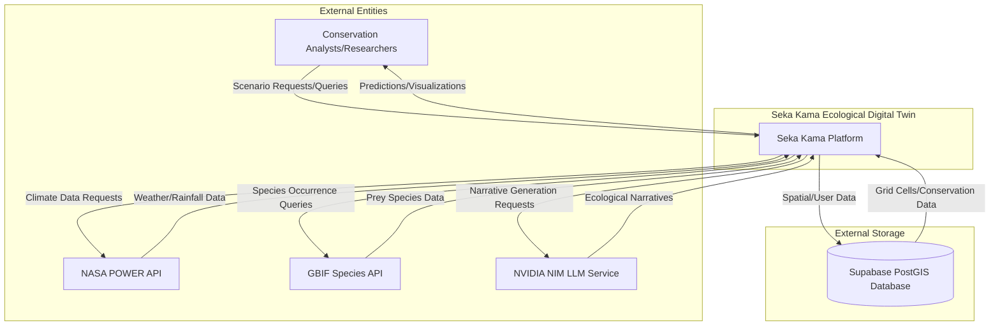
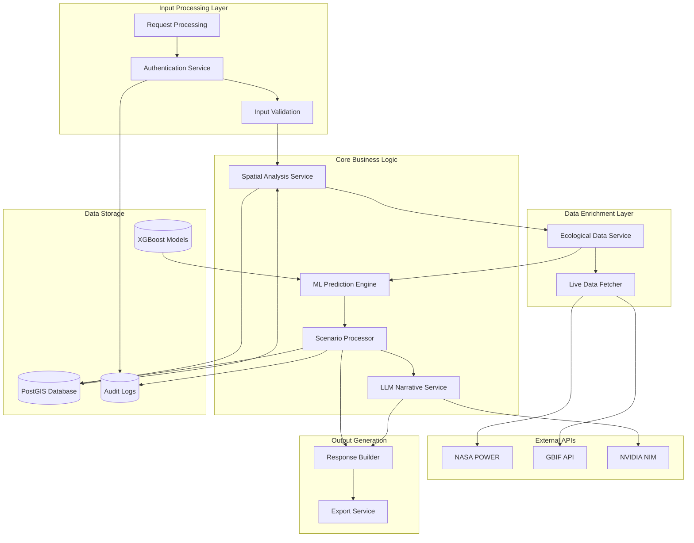
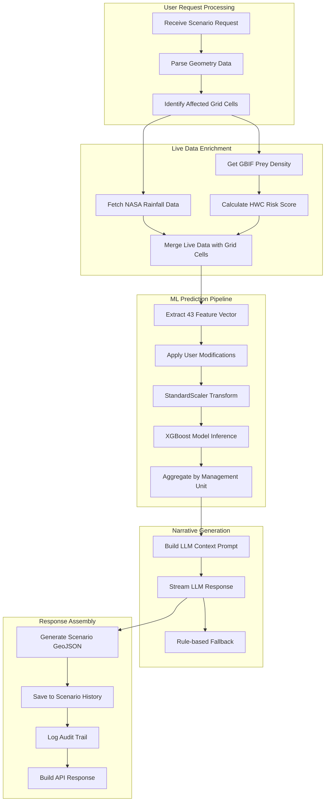
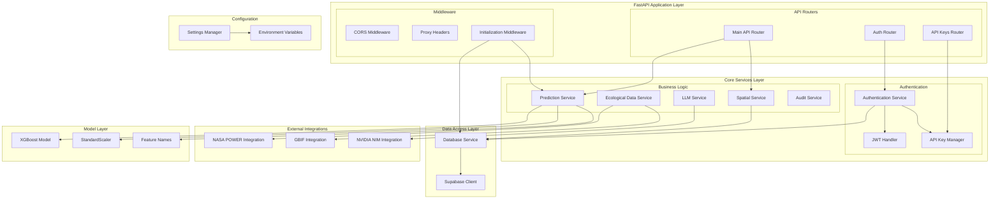
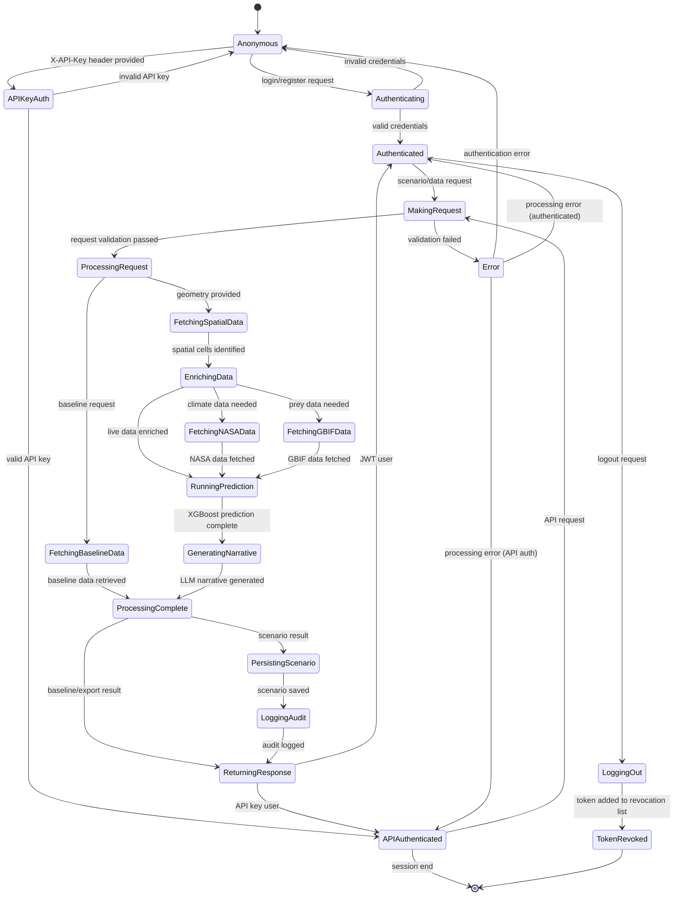
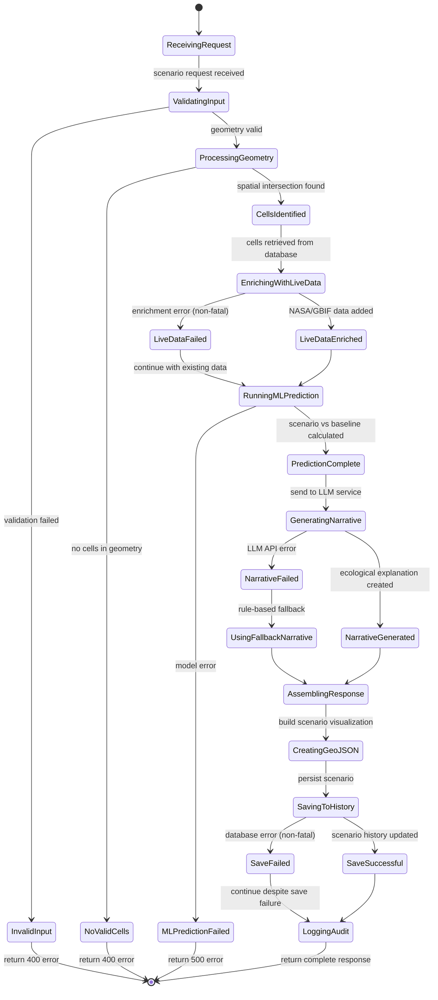
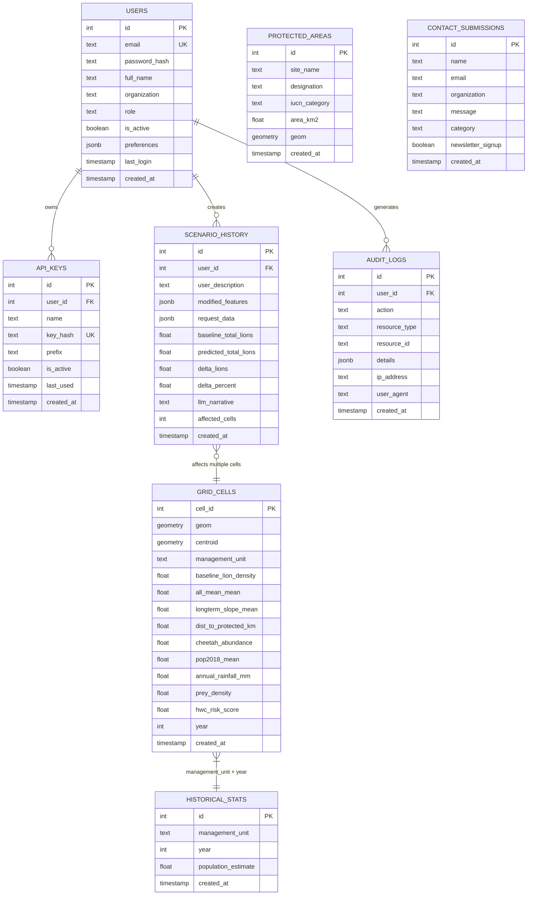
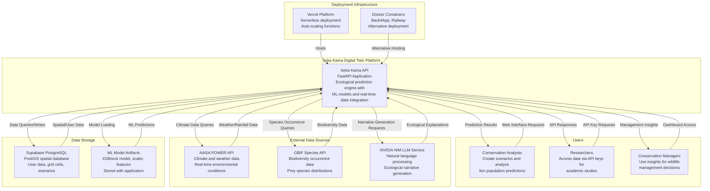
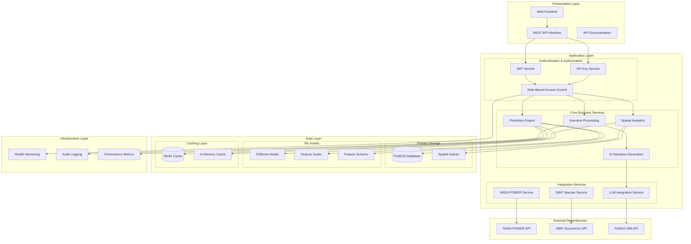

# Seka Kama System Architecture Diagrams

## 1. Data Flow Diagram (DFD) - Level 0 (Context Diagram)



## 2. Data Flow Diagram (DFD) - Level 1 (System Overview)



## 3. Data Flow Diagram (DFD) - Level 2 (Detailed Process Flow)



## 4. UML Component Diagram



## 5. UML Class Diagram (Core Services)

```mermaid
classDiagram
    class SupabaseService {
        -client: Client
        +get_grid_cells(management_unit, year, limit) List~Dict~
        +get_grid_cells_by_geometry(geojson, units) List~Dict~
        +save_scenario(user_id, description, modifications) Dict
        +verify_api_key(key_hash) Dict
        +update_user_last_login(user_id) void
    }

    class PredictionService {
        -model: XGBoostModel
        -scaler: StandardScaler
        -feature_names: List~str~
        -feature_indices: Dict~str, int~
        +predict_batch(features) ndarray
        +predict_grid_cells(grid_cells) ndarray
        +run_scenario(baseline_cells, modifications) Dict
        +get_feature_importance() List~Dict~
    }

    class SpatialService {
        +get_affected_cells(supabase, geometry, units) List~Dict~
        +get_baseline_grid(supabase, management_unit, bbox) List~Dict~
        +get_protected_areas(supabase, bbox) List~Dict~
        +geojson_to_wkt(geojson) str
    }

    class EcologicalDataService {
        +fetch_gbif_prey_density(lon, lat, radius) float
        +fetch_real_nasa_annual_rainfall(lon, lat, year) float
        +enrich_cells_with_live_data(cells) List~Dict~
        +get_live_ecosystem_indicators(management_unit) List~Dict~
    }

    class LLMService {
        -client: OpenAI
        +augment_modifications_from_text(query, mods) Dict~str, float~
        +generate_narrative(scenario_request, results) str
        +generate_explanation(features, prediction) str
        -_stream_completion(prompt, max_tokens) str
    }

    class AuthService {
        +verify_password(plain, hashed) bool
        +get_password_hash(password) str
        +create_access_token(data, expires_delta) str
        +get_current_user(credentials, api_key_data) TokenData
        +is_token_revoked(token) bool
    }

    class Settings {
        +DEBUG: bool
        +SUPABASE_URL: str
        +JWT_SECRET_KEY: str
        +MODEL_PATH: str
        +LLM_API_KEY: str
        +validate() void
        +get_cors_config() Dict
    }

    SupabaseService --> PredictionService : provides data
    SpatialService --> SupabaseService : queries spatial data
    EcologicalDataService --> SupabaseService : enriches data
    PredictionService --> LLMService : provides results for narrative
    AuthService --> SupabaseService : validates users
    Settings --> "*" : configures all services
```

## 6. State Diagram (User Session and Authentication)



## 7. State Diagram (Scenario Processing Workflow)



## 8. Entity Relationship Diagram (ERD)



## 9. System Context Diagram (C4 Model - Level 1)



## 10. System Architecture Overview



These diagrams comprehensively illustrate the inner workings of the Seka Kama ecological digital twin system, showing data flows, component relationships, state transitions, database structure, and overall system architecture. The system demonstrates a sophisticated integration of machine learning, spatial analysis, real-time data enrichment, and AI-powered narrative generation for wildlife conservation decision support.